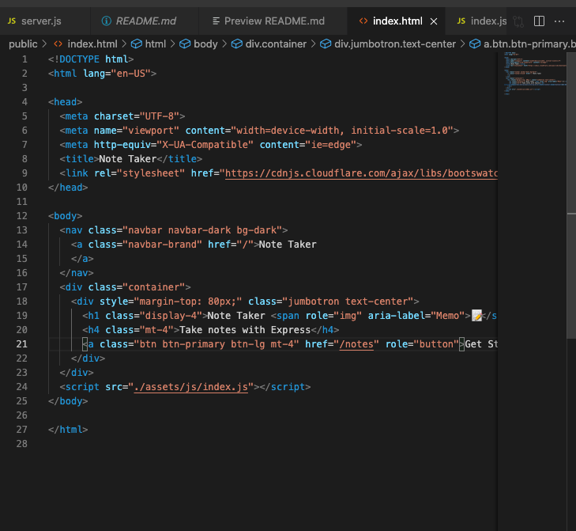
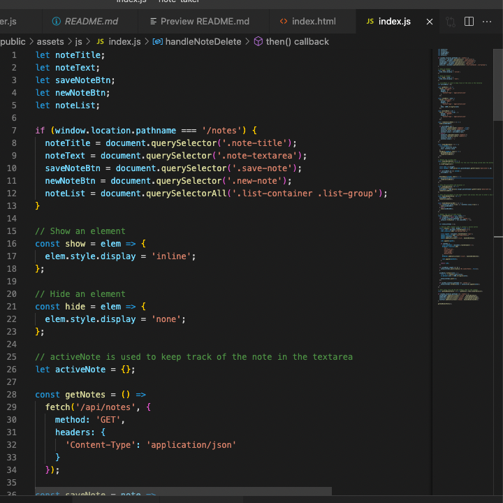
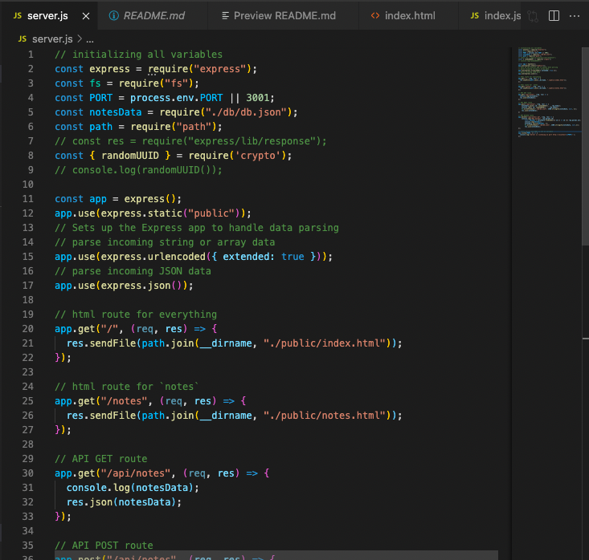
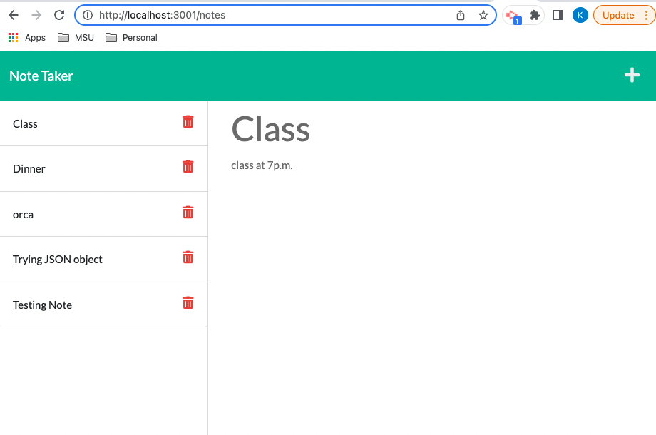
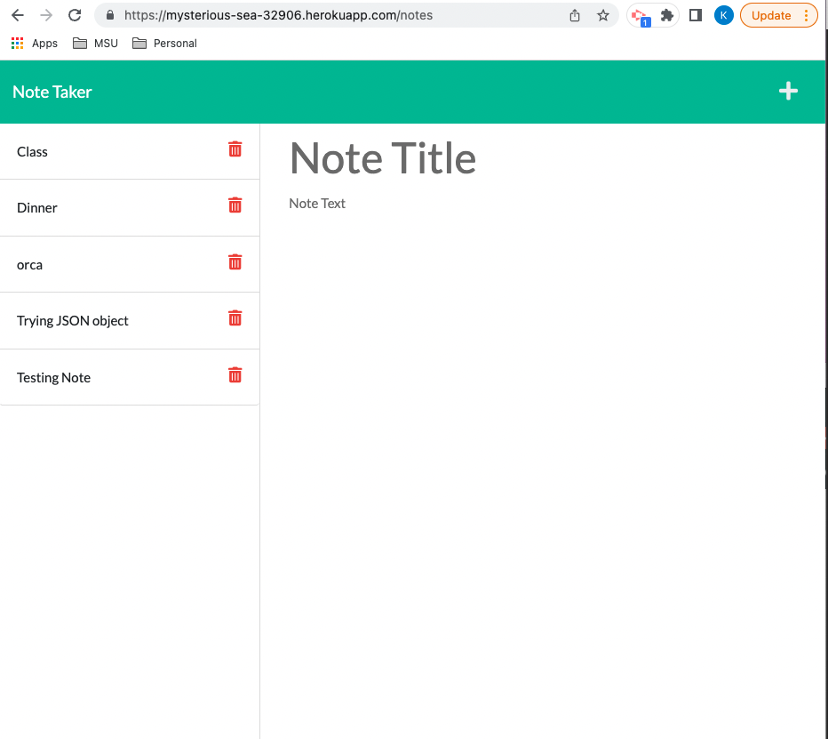

# Note Taker

### Description:
```
create an application called Note Taker that can be used to write and save notes. This application will use an Express.js back end and will save and retrieve note data from a JSON file.

The application’s front end has already been created. It's your job to build the back end, connect the two, and then deploy the entire application to Heroku.
```
## User Story
```
AS A small business owner
I WANT to be able to write and save notes
SO THAT I can organize my thoughts and keep track of tasks I need to complete
```

## Acceptance Criteria
```
GIVEN a note-taking application
WHEN I open the Note Taker
THEN I am presented with a landing page with a link to a notes page
WHEN I click on the link to the notes page
THEN I am presented with a page with existing notes listed in the left-hand column, plus empty fields to enter a new note title and the note’s text in the right-hand column
WHEN I enter a new note title and the note’s text
THEN a Save icon appears in the navigation at the top of the page
WHEN I click on the Save icon
THEN the new note I have entered is saved and appears in the left-hand column with the other existing notes
WHEN I click on an existing note in the list in the left-hand column
THEN that note appears in the right-hand column
WHEN I click on the Write icon in the navigation at the top of the page
THEN I am presented with empty fields to enter a new note title and the note’s text in the right-hand column

```

  

  ## Table of contents
  1. [Title](#title)
  2. [Description](#description)
  3. [Installation](#installation)
  4. [Usage](#usage)
  5. [Contributing](#contributing)
  6. [Test](#test)
  7. [License](#license)
  8. [Questions](#questions)

  ## Title
  Note Taker

  ## Description
  This application will you write and save notes

  ## Installation
  run `npm install express` 

  ## Usage
  run `npm start` to start server and hit `http://localhost:3001` (locally) to go to main page

  ## Contributing
  start with a branch and request PR for merge

  ## Test
  always test on local environment

  ## License
  [MIT](https://gist.github.com/nicolasdao/a7adda51f2f185e8d2700e1573d8a633#mit-license)

  ## Questions
  no question at this time<br />
  Find me on Github [kazichaska](https://github.com/kazichaska)<br />
  Email me with any question: kazichaska@gmail.com <br />

## Deployed Application Video Link 
Application is also deployed in Heroku:
https://mysterious-sea-32906.herokuapp.com/notes 

## Screenshots of the code









